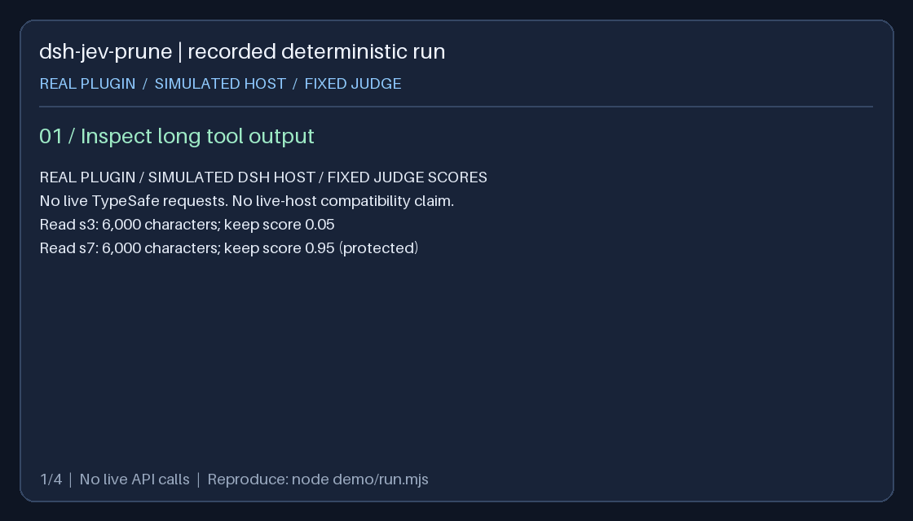

# dsh-jev-prune


为 [DeepSeek Harness](https://github.com/deepseek-ai/deepseek-harness) 提供语义化工具结果裁剪和确定性回执压缩，由 [TypeSafe Jev](https://typesafe.ai) 提供结构化判断。

[English](README.md) · **简体中文**

   [](https://github.com/yangyu666/dsh-jev-prune/actions/workflows/ci.yml)  [](https://dsh-plugin.org/plugins/yangyu666/dsh-jev-prune)

## 解决什么问题

长任务会积累大量工具输出。按体积截断无法区分关键证据和已用完的内容，模型摘要则可能引入没有依据的描述。插件用结构化判断选择要压缩的内容，保留原始会话事件，并由代码生成回执。

## 双层机制

| 层级 | 行为 |
|---|---|
| 工具结果裁剪 | 按判定排序选择结果，保留头部、标记和尾部。保护最近及排除项；缺少判定时回退宿主体积规则。 |
| 确定性回执 | 将合格的只读步骤替换为事实回执。混合并行批次保留调用与结果外壳，仅替换合格结果正文。 |


回执记录工具名、入参、序号、输出大小，以及有长度上限的助手可见原话。第二层受写操作保护、最近区、证据词与配对检查约束。[机制和配置详解](ARCHITECTURE.md#implementation-reference)

## Demo



录制运行真实插件的 `apply()`、注册工具与替换路径，使用模拟 DSH 宿主和固定判定概率。依次展示裁剪、保留高分结果、生成回执和读取区域检查点原文。它不代表真实 Jev 判断质量，也不能证明真实宿主端到端兼容。

[回放、断言与重新生成](demo/README.md) · [原始演示记录](assets/demo.json)

## 实测结果

此前记录的 37 步 `semver@6e05b76` 顺序读文件任务对比原生 DSH、仅第一层与双层插件。每个完成的长任务，未缓存输入 token 为：基线 **75,781–87,872**，双层插件 **25,516–45,071**。

这些是特定工作负载的上游观测，不是已独立复现的基准。仓库尚未提供原始日志、Jev 成本和完整复现脚本；缓存命中与未命中 token 必须分开比较。[测量细节与边界](docs/measurements.md)

## 快速开始

要求 Node `^22.19.0 || >=24.0.0`、带基础裁剪和压缩服务的 DSH profile，以及 `TYPESAFE_API_KEY`。已测试宿主为 **DSH 0.1.5-rc.2**。

```bash
git clone https://github.com/yangyu666/dsh-jev-prune.git
cd dsh-jev-prune
npm ci
npm run check
npm run smoke
# 使用此仓库的绝对路径：
dsh plugin --profile web add link:/absolute/path/to/dsh-jev-prune
```

启动 DSH 前在环境中配置 `TYPESAFE_API_KEY`。建议先开启 `dryRun: true`，通过 `/jev` 查看状态，执行 `jev_probe_shapes` 验证事件结构。`jev_restore` 只读返回区域检查点内容，不恢复 surface。

无 pnpm 时参见[手动接线](docs/implementation.md#install)。固定版本安装与发布条件见[发布准备](RELEASING.md)。这些命令不假定 npm 包或版本 tag 已发布。

## 限制与数据处理

- 在线判定会将历史、路径、代码片段和命令输出发送至 TypeSafe，并增加判定成本与延迟。
- CI 验证纯函数、模拟宿主行为和锁定宿主依赖树的模块加载；尚不覆盖真实 DSH 会话端到端执行。
- 回执只能领取一次，但当前令牌无法识别外部并发摘要的事务归属；应避免并发压缩。[审查记录](docs/review-2026-10-05.md)
- 结果判定按序号缓存，任务目标变化不会使其失效；第一层小样本降级可能在压力比例为零时裁剪。
- `jev_restore` 只查区域摘要检查点，每个事件最多返回 4,000 个 UTF-16 单元，尚不能直接解析第一层或逐结果替换的 ID。原始事件仍保存在日志中。

## 开发与文档

```bash
npm run check
npm run smoke
npm run coverage
node demo/run.mjs
```

[贡献指南](CONTRIBUTING.md) · [架构](ARCHITECTURE.md) · [完整配置](docs/implementation.md#configuration) · [移植契约](PORTING.md) · [示例](examples/README.md) · [变更记录](CHANGELOG.md)

MIT。
