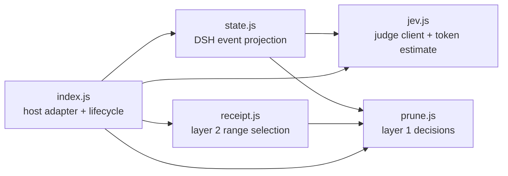

# Architecture

`dsh-jev-prune` adds two context-reduction layers to DeepSeek Harness while keeping DSH's event log as the source of truth.

## Modules

- `compatibility.js` separates actual runtime version, verified-version evidence and service capabilities. The manifest owns supported release families.

- `jev.js` owns the remote judge protocol, retry classification, batching, and local token estimation.
- `prune.js` contains layer-1 pure logic: cached-verdict lookup, pressure-budget planning, code-point-safe slicing, and DSH-compatible replacement events.
- `state.js` converts session events into the bounded state and questions sent to Jev. It also discovers tool names and selects candidates.
- `receipt.js` contains layer-2 pure logic: tool-pair balance checks, evidence guards, two-axis eligibility, contiguous range selection, and deterministic receipt rendering.
- `index.js` is the only host adapter. It resolves configuration, installs DSH hooks, owns per-session caches, invokes both layers, exposes tools/commands, and writes observability snapshots.

The dependency direction stays toward the pure modules. Host APIs must remain in `index.js`; moving them into `prune.js` or `receipt.js` would make the safety logic harder to test outside DSH.

## Runtime flow

New Web profiles isolate compaction services in presets. The root plugin only injects tools, then resolves the active Agent's pruner, compaction and meter through the host `serviceForAgent` API before the base pruning hook. Per-engine hook maps prevent cross-preset sharing; legacy root services remain supported. [Compatibility verification](compatibility.md).

1. A prepended `agent/pre-step` hook builds the current state and asks Jev only for missing verdict axes.
2. DSH's `compaction-basic` hook calls the synchronously overridden `toolResultPruner.pruneSession`. Layer 1 reads the verdict cache and replaces stale result bodies with head/marker/tail content.
3. The normal second plugin hook selects read-only call/result pairs whose result and effect verdicts are both low. Fully eligible steps become balanced contiguous ranges; mixed parallel batches become per-result replacements matched by `callId`.
4. Full ranges run through the captured `compactRegion` in an AsyncLocalStorage transaction. The summary hook checks session, exact replay messages (with an optional system head), cancellation, lifetime and claim-once state. Host calls to the public region entry clear inherited receipt ownership. Mixed batches use DSH's single-node shadow-price + `tool/result` replacement protocol.
5. Original events remain in the session log. The surface points to replacement or compaction events, and `jev_restore` can retrieve the shadowed text.

## State and identity

Verdicts are held in a `WeakMap<session, Map<seq, verdict>>`. A layer-1 replacement receives a new seq and records the old seq in `sourceEventSeqs`; cache lookup follows that metadata so both layers keep the same judgment. In-memory verdicts are rebuilt after a process restart.

The result-axis cache is additionally keyed by a SHA-256 revision of the sequence identities and complete text of the latest three non-checkpoint user instructions. This is deliberately not the truncated 500-character judge header. A revision change clears result probabilities and sets a conservative keep, while retaining effect probabilities. Judge, synchronous pruner and manual compaction entry all refresh the revision; old-goal in-flight responses are discarded. Assistant/tool progress alone does not invalidate the cache. This policy detects instruction changes, not every semantic change in an evolving task.

The pressure ratio is also session-scoped. `judgePass` computes it asynchronously, and the synchronous layer-1 override consumes it later in the same pre-step chain.

## Safety invariants

- Never split an unbalanced tool-call/result range.
- Never compact write-like tools; layer 2 uses a read-only allow-list plus a deny-list.
- Preserve recent surface nodes independently for each layer.
- Scan replacement source chains for error/assert/failure evidence.
- Fall back conservatively when the context window, event shape, or judge result is unavailable.
- Inject a receipt only when the active transaction owns the pending token.
- Keep deterministic receipts factual: tool, arguments, seq, and output size; no model-generated conclusion.

## Parallel batch boundary

One assistant message may contain several parallel tool calls. They share one head event, and DSH 0.1.5's contiguous-range API cannot remove only a subset of those pairs. Mixed batches therefore compact eligible result bodies in place; only a fully eligible batch removes its assistant head and result nodes. This keeps the surface valid without fabricating assistant messages or depending on an unsupported multi-node insertion API.

## Implementation reference

Detailed configuration, gating, protocol history and troubleshooting moved to [the implementation reference](implementation.md). Measurement notes are in [measurements](measurements.md). The recorded [demo](../demo/README.md) runs real plugin code with a simulated host.

The published 0.1.0 used a global active fence and session-keyed pending receipt. Current unreleased source replaces it with async transaction ownership and replay-input validation. Host serialization and surface-stability checks remain the host's responsibility. Alternate backends whose replay input differs from DSH's contract fall back to their original summarizer.
